With my first virtulization server project in the works, there is still one major hurdle I have to get past before I can really get to work on that. My college dorm internet. This thread will be all about my findings and experience with pfSense, the first addition to my first homelab.

## Problems to Solve

1. My dorm only gives me a single ethernnet jack with a single connection, I’d like to be able to manage and switch that connection.

1. There is no way for me to port forward on my dorm connection, so even though I have 400 up and down, I can’t really host anything.

1. I’d like to be able to remote into my network without making everything public to the entire dorm. (I can see everyone’s game consoles when I open spotify)

## The Hardware

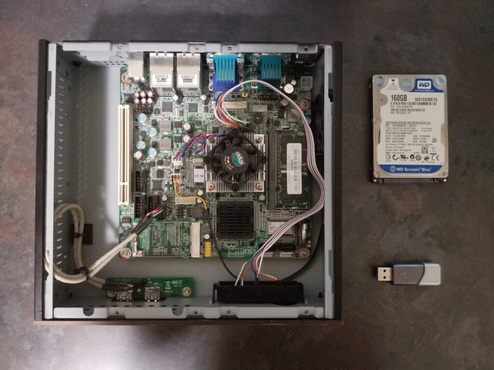

Originally serving time in use in an ASU linux development class, this box eventually made it into a lot of “computer parts” in a surplus auction. A friend and I got a couple of these along with a bunch of other disregarded university hardware for basically nothing (ASU also did not bother clearing off the drive). This box ended up being a really good canidate for pfSense.

- CPU: Intel Atom D510 (2c4t@1.66GHz, 13W)
- RAM: 1GB DDR2
- HDD: WD Scorpio Blue 160GB
- MOBO: 1 SODIMM Slot, 2 1GIG Ethernet, VGA, Lots of Serial

The CPU actually ended up being a lot more than I thought it would be. I was expecting 1c2t honestly. I could get some mildly serious stuff running on here with just a simple RAM upgrade. That plus the dual 1GIG ports made this almost perfect for my first pfSense box.

## Setup

Setup was actually pretty painless all things considered. The only issue I faced was some wonky stuff with the bootable USB drive I had with the pfSense iso on it constantly formatting itself for no reason. After that, I followed the guided setup, plugged into the LAN port to finish things up, and that was it. For open-source router software, that was way more plug-and-play than I expected.

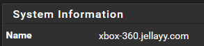

Hopefully this will allow me to not raise too much suspicion if someone were to check the dorm network. A device named “xbox 360” on ethernet pumping out a lot of encrypted traffic looks normal right?

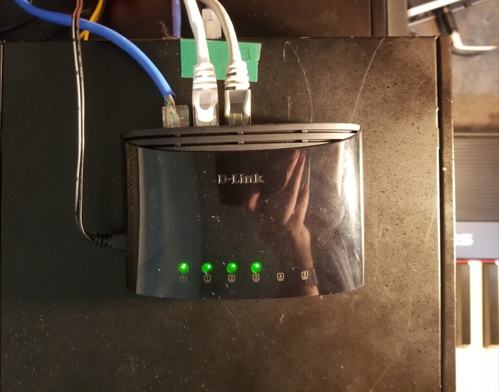

Currently, I’m simply using one of the ports on the pfSense box for my WAN interface and the other for my LAN interface going straight into a tiny, USB powered, unmanaged switch. As my homelab scales up, this will definitely be a canidate for an upgrade. This tiny thing doesn’t like it when running local iso transfers to my server and other downloads at the same time. I’d like to get a rack-mountable managed cisco switch as I am very familiar with the Cisco iOS and could easily set up VLANs and ACLs on it.

## First Homelab Evolution

I never actually ended up finishing this writeup back in 2020, but I recently came across more photos of my first College Dorm Homelab and I thought I would document how it evolved here.

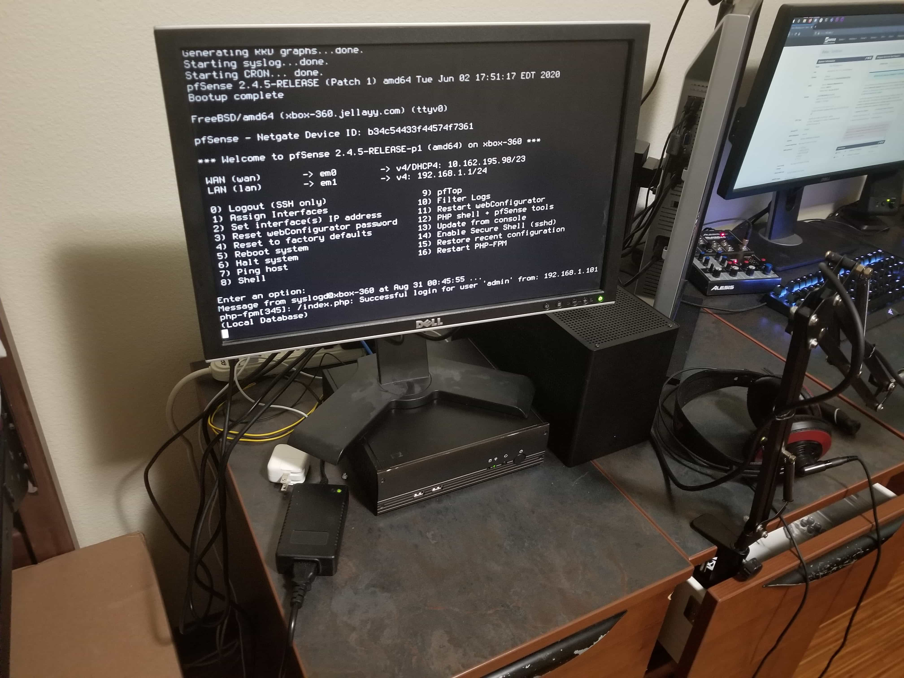

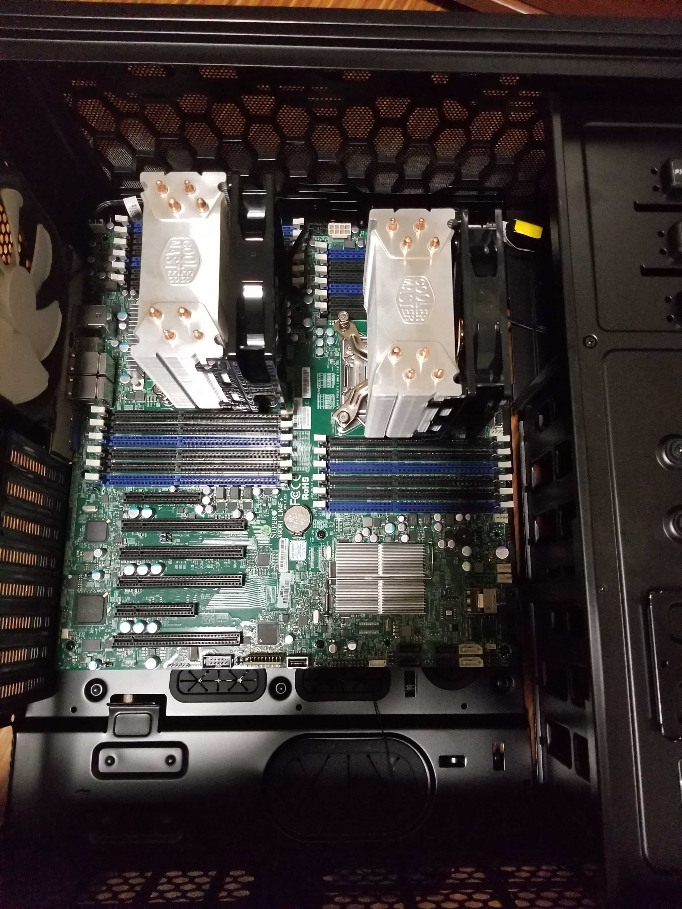

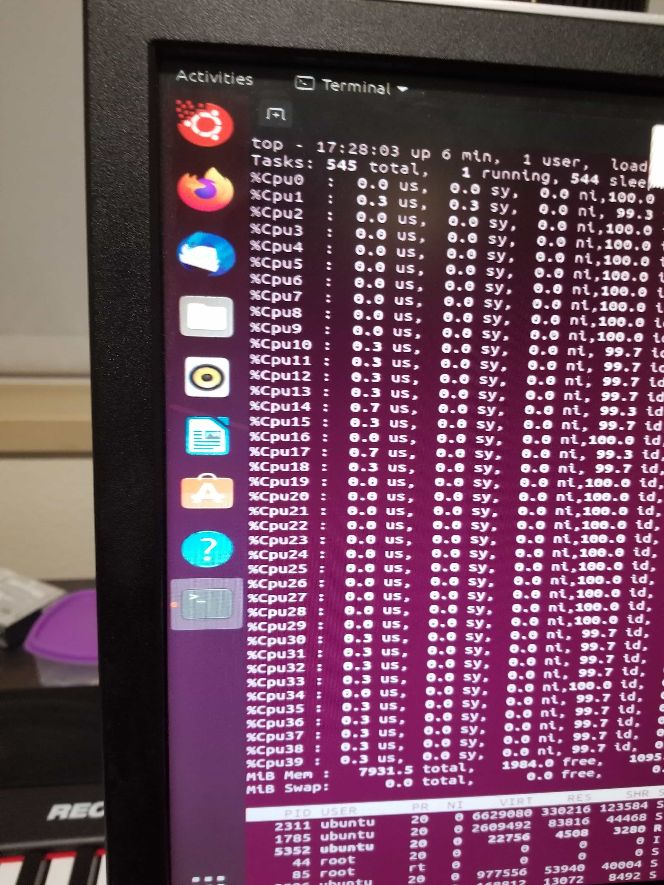

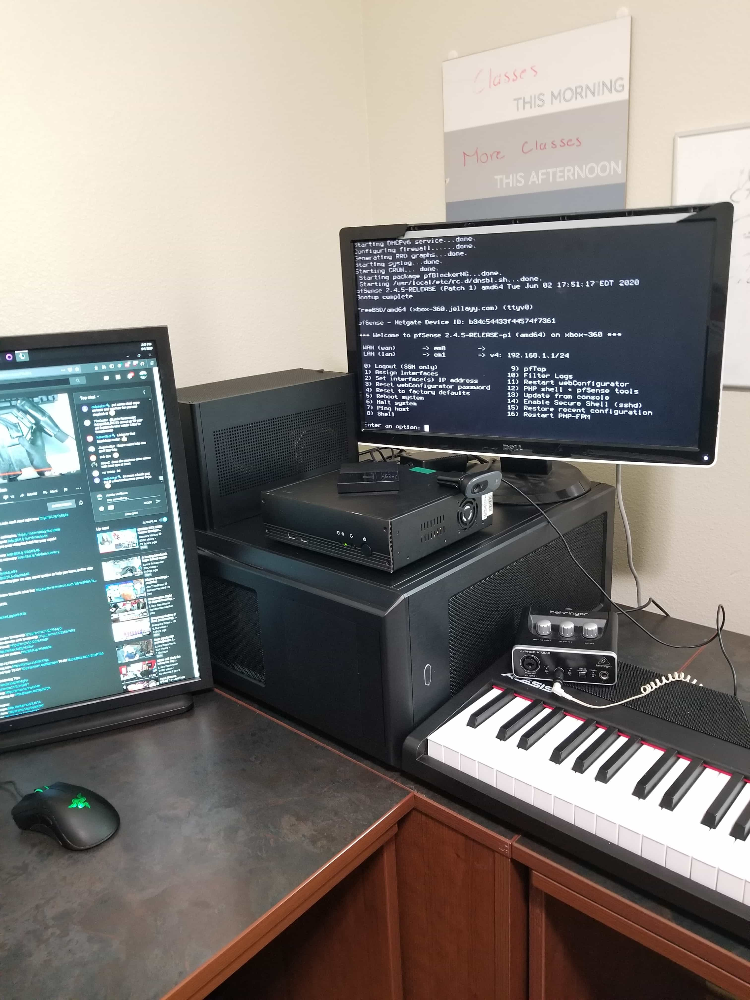

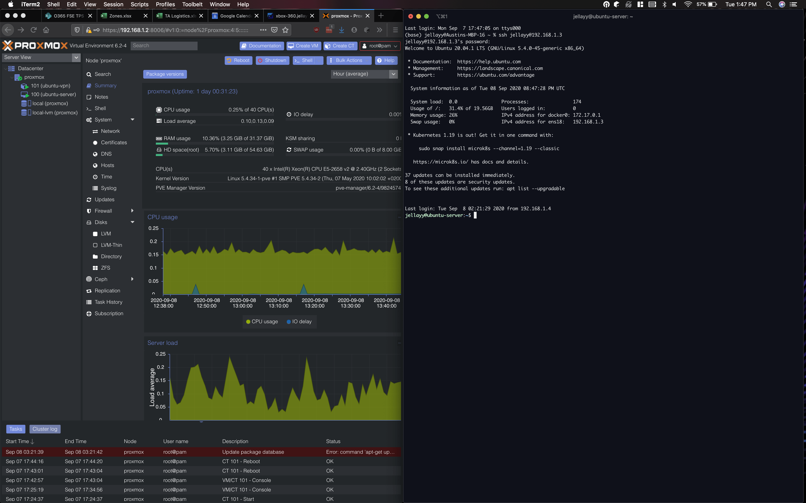

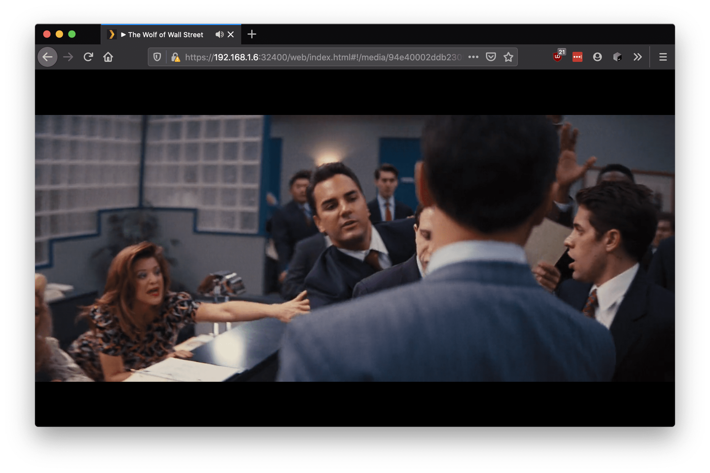

")

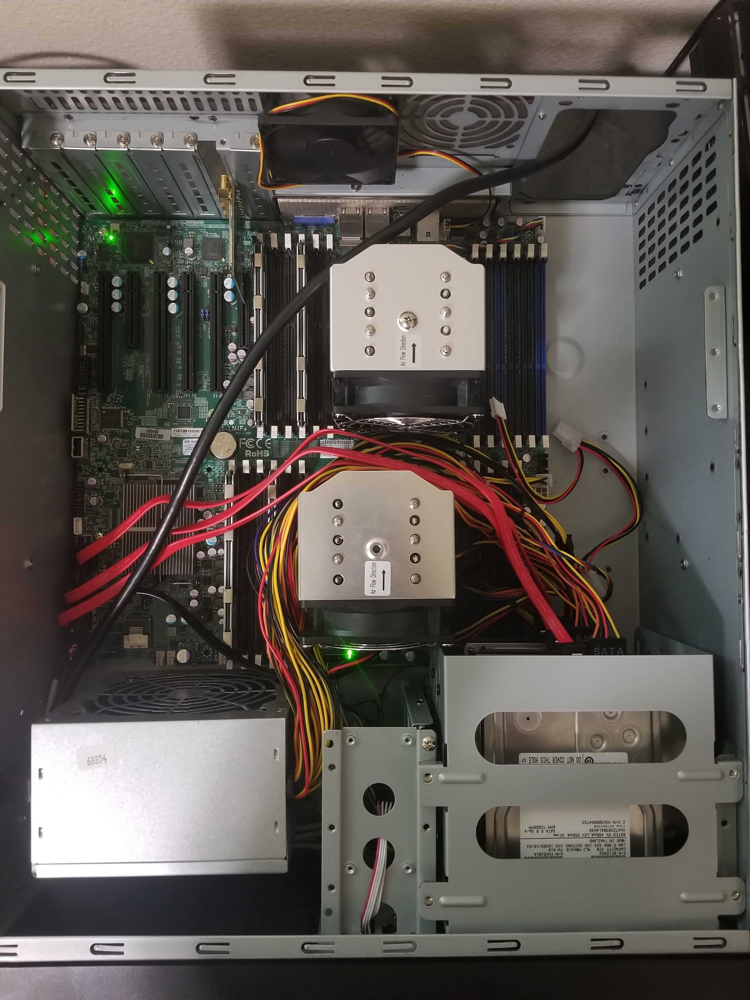

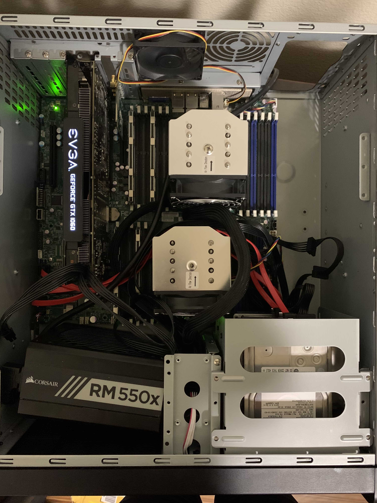

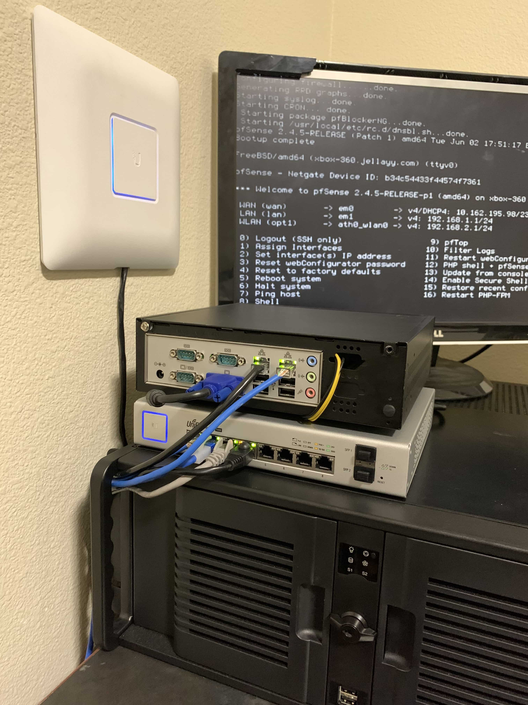

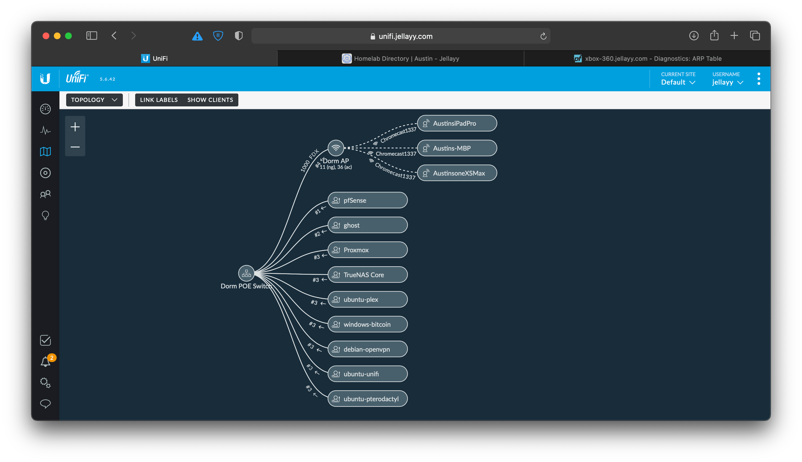

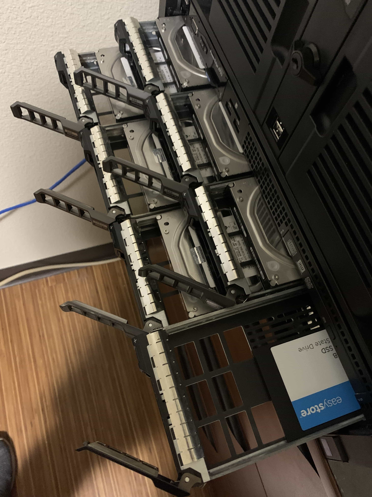
