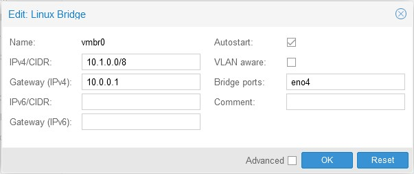
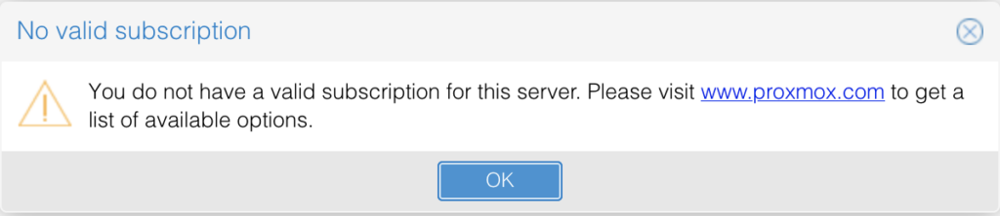

Whether it be by wanting to start from scratch again, completely breaking everything, or having no backups when a drive dies, I install Proxmox quite frequently and I always seem to miss something. This writeup is mostly for myself to use for when I inevitably have to reinstall Proxmox again, but would also be a good guide to follow along to optimise your setup.

Of course the first step is to install the iso onto your boot drive, but I don’t think I need to explain that here.

## Configuring the Network Interface

Since most of your management of Proxmox is going to be remote, getting your network set up correctly is usually my first step.

First for me is setting up a static IP. Personally, I also give this IP a custom DNS entry in pfSense as well. See my pfSense guide for instructions on how to do that.



After this, don’t forget to change the address in /etc/hosts as well, or else the webUI will open on the wrong address and be unaccessible. You also won’t be able to authenticate with SSH if this happens.

## Remove Subscription Message



1. Make a backup of `proxmoxlib.js`

    ```sh
    cd /usr/share/javascript/proxmox-widget-toolkit
    cp proxmoxlib.js proxmoxlib.js.bak
    ```

1. Edit `proxmoxlib.js` to replace the following function call:

    ```js
    Ext.Msg.show({
      title: gettext('No valid subscription'),
    ```
    ```js
    void({ //Ext.Msg.show({ // Replaced Line
      title: gettext('No valid subscription'),
    ```

1. Restart the proxmox web service

    ```sh
    systemctl restart pveproxy.service
    ```

## PVEDiscordDark

I love the Proxmox web interface, but it’s a little too bright. Thankfully, Weilbyte maintains a great and easy to install dark theme for the UI.

Github: [Weilbyte/PVEDiscordDark](https://github.com/Weilbyte/PVEDiscordDark)
```sh
wget https://raw.githubusercontent.com/Weilbyte/PVEDiscordDark/master/PVEDiscordDark.sh
bash PVEDiscordDark.sh install
```

## Enable Updates

Now, if you’re like me, you don’t pay for proxmox. However, it is stil pretty easy to enable updates without a subscription.

First, you’ll want to edit your `/etc/apt/sources.list` with the latest no subscription sources from [here](https://pve.proxmox.com/wiki/Package_Repositories).

```
deb http://ftp.debian.org/debian bullseye main contrib
deb http://ftp.debian.org/debian bullseye-updates main contrib

# PVE pve-no-subscription repository provided by proxmox.com,
# NOT recommended for production use
deb http://download.proxmox.com/debian/pve bullseye pve-no-subscription

# security updates
deb http://security.debian.org/debian-security bullseye-security main contrib
```

If you don’t have a subscription, you’ll also have to comment out this line in `/etc/apt/sources.list.d/pve-enterprise.list`

```
# deb https://enterprise.proxmox.com/debian/pve bullseye pve-enterprise
```

After that, you can test your changes with:

```sh
apt update
apt dist-upgrade
```
