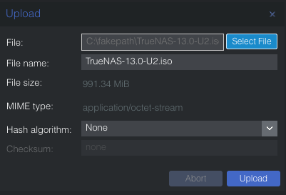
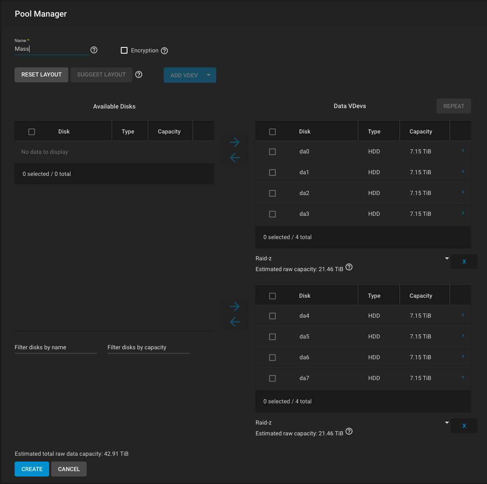
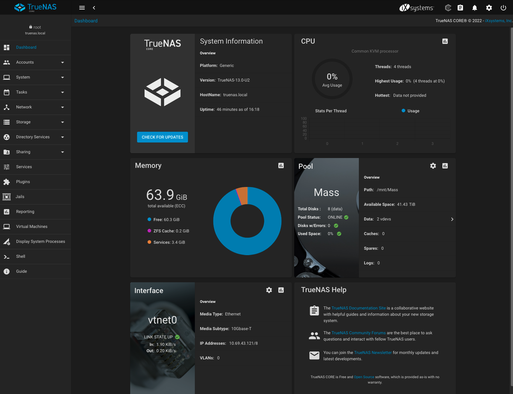

I’ve been running TrueNAS Core virtualized under Proxmox for all of my storage management for the better part of two years now. For my purposes up until now, a very simple setup with a few 3TB drives passed through has been perfect and extremely resilient. I’ve completely destroyed my TrueNAS VM multiple times and was able to recreate the VM in Proxmox, have TrueNAS auto import my pool, and I was back up and running.

However, I recently impulse bought 64TB worth of SAS drives on eBay (as we all do) and thought it would be a great time to make the best virtualized TrueNAS setup I can. And, of course, I’ll be making this guide alongside it.

## Prerequisites

This guide is based on a virtualized setup. While a lot of the information here can be useful for other hardware, virtualization platforms, or even bare-metal setups, this guide is based around the following setup:

- Hardware: Dell Poweredge r720
- Host OS: Proxmox 7+
- Software: TrueNAS Core 13.0-U2+

## Getting TrueNAS Core

As of writing this guide, I am still using TrueNAS Core and will be for the forseeable future. For the purposes of just a virtualized NAS, TrueNAS Core is currently the better solution over TrueNAS Scale for scope of the platforms alone. TrueNAS Core is also still under development and hasn’t reached performance and reliability parity with the base features of TrueNAS Core.

[The latest version of TrueNAS Core can be found here.](https://www.truenas.com/download-truenas-core/)

After downloading TrueNAS, we can upload the ISO to Proxmox:



## Creating the VM

When deciding on the resources to pass to your VM, the [official CORE Hardware Guide](https://www.truenas.com/docs/core/gettingstarted/corehardwareguide/) can be helpful, but there aren’t solid numbers for a lot of specs as it’s very workload-dependent. I’m following some typically recommended rules that have worked well for me (eg: 1GB RAM per 1TB of storage without dedupe) and will update this guide when I run into issues.

Here are the specs I am building the VM with based on my setup of 8 8TB drives:

- Guest OS Type: Other
- Machine Type: q35 (for PCIe passthrough support, otherwise default)
- BIOS: OVMF (for PCIe passthrough support, otherwise default)
- Boot Disk: SCSI 32GB
- CPUs: 4 cores
- RAM: 64GB (65536MiB)
- Network Device Model: VirtIO

### Startup Options

Since a good amount of my VMs will depend on the shares served by my TrueNAS VM, there are some settings you can add in Proxmox to give TrueNAS time to boot before other VMs that depend on it when your server restarts.

- TrueNAS VM Options:
    - Start at boot: `Yes`
    - Start/Shutdown order: `order=2,up=300`
- Dependent VM Options:
    - Start at boot: `Yes`
    - Start/Shutdown order: `order=3`
- Independent VM Options:
    - Start at boot: `Yes`
    - Start/Shutdown order: `order=1`

### Run the Installer

At this point, I like to go ahead and run the installer before I attach any additional drives other than the boot drive just to have a headache-free installation process.


   If you’re running the q35 machine type with the OVMF BIOS, SecureBoot will be enabled by default, and may prevent the TrueNAS ISO from booting. Press ESCAPE during boot and disable SecureBoot to fix this. 


### Passing Drives

There are multiple way to go about passing your drives to your TrueNAS VM. In the past, I have passed individual drives through Proxmox with no issue; however, now that I am using my server’s entire backplane for ZFS drives, it makes sense to pass through the backplane’s controller for maximum performance and functionality in TrueNAS.

#### Individual Drives

The best way to pass individual drives to TrueNAS is to do it by drive ID rather than sd#. It is common for sd#’s to change on boot and that can definitely cause issues. As of Proxmox 7.1, there is no way to do this in the UI, so we will use the shell.

1. Start by listing the drives on your system:

    ```sh
    ls -l /dev/disk/by-id
    ```
    ```sh
    lrwxrwxrwx 1 root root  9 Sep  2 09:42 scsi-35000cca262027d20 -> ../../sdc
    lrwxrwxrwx 1 root root  9 Sep  2 09:52 scsi-35000cca2620a4f9c -> ../../sde
    lrwxrwxrwx 1 root root  9 Sep  2 09:46 scsi-35000cca2620d5648 -> ../../sdg
    lrwxrwxrwx 1 root root  9 Sep  2 09:55 scsi-35000cca2621193f8 -> ../../sdd
    lrwxrwxrwx 1 root root  9 Sep  2 09:35 scsi-35000cca262127f30 -> ../../sdi
    lrwxrwxrwx 1 root root  9 Sep  2 09:49 scsi-35000cca26213d99c -> ../../sdf
    lrwxrwxrwx 1 root root  9 Sep  2 09:38 scsi-35000cca26213e0ec -> ../../sdb
    lrwxrwxrwx 1 root root  9 Sep  2 08:57 scsi-35000cca26213faec -> ../../sdh
    ```

2. When you find the serial identifier of the drive you want to add, you can bind it to your VM with:

    ```sh
    qm set 100 -scsi1 /dev/disk/by-id/scsi-35000cca262027d20
    ```
    
    Be sure to use your VM identifier and incrament the drive number as you add drives
    

3. If everything was done correctly, you should see any drives you add in your VM's hardware section:

    

#### Controller Passing

Passing through a controller can be a bit more work than passing through individual drives, but has some advantages if you can justify it.

Before we go any further there are some steps we need to take to be able to pass through PCI devices, namely enabling IOMMU.

The [PCI Passthrough Proxmox Wiki page](https://pve.proxmox.com/wiki/PCI_Passthrough) is a great resource on this. I suggest following it, but relevant commands for my hardware will be outlined here as well. If you’re not using an Intel-based system or GRUB as your bootloader, use the commands for your system from the wiki.

1. Open the GRUB config file:

    ```sh
    nano /etc/default/grub
    ```

1. Find the line with `GRUB_CMDLINE_LINUX_DEFAULT` and add `intel_iommu=on`:

    ```sh
    GRUB_CMDLINE_LINUX_DEFAULT="quiet intel_iommu=on"
    ```

1. Another option you can enable is the parameter `iommu=pt` which can improve performance for hypervisor PCI devices that aren’t passed through to a VM:

    ```sh
    GRUB_CMDLINE_LINUX_DEFAULT="quiet intel_iommu=on iommu=pt"
    ```

1. Save the changes and update grub:

    ```sh
    update-grub
    ```

1. For PCI passthrough, some additional modules will have to be added to `/etc/modules`:

    ```
    vfio
    vfio_iommu_type1
    vfio_pci
    vfio_virqfd
    ```

1. Reboot your server

1. You can verify that IOMMU is enabled with the command:

    ```sh
    dmesg | grep -e DMAR -e IOMMU
    ```

    And looking for the line: `DMAR: IOMMU enabled`

    You can also verify that IOMMU Interrupt Remapping is supported by your CPU:

    ```sh
    dmesg | grep 'remapping'
    ```

    And looking for a line similar to: `DMAR-IR: Enabled IRQ remapping in x2apic mode`

1. Once IOMMU is enabled, we need to make sure that ALL the drives connected to the drive controller you are passing are the ones you want to pass and no others are connected to the controller. Passing a drive controller is all or nothing. Every drive connected to that controller will be passed to your VM.

    To see what controller a drive is connected to, you can run:

    ```sh
    udevadm info -q path -n /dev/sda
    ```
    ```sh
    /devices/pci0000:00/0000:00:1f.2/ata1/host1/target1:0:0/1:0:0:0/block/sda
    ```

    `sda` is my Proxmox boot drive, and here we can see it is connected to PCI ID: `0000:00:1f.2` or `00:1f.2` in shorthand.

    ```sh
    /devices/pci0000:00/0000:00:02.2/0000:03:00.0/host0/port-0:8/end_device-0:8/target0:0:8/0:0:8:0/block/sdb
    ```

    `sdb` is one of the drives I’m looking to pass through, this shows it’s connected to PCI ID: `03:00.0`. For extra confirmation, I ran this command on all of the other drives on my backplane and they’re all connected to the same PCI ID. This means all the drives are on the same controller as planned.

1. Next we will check that your drive controller is in its own IOMMU group so that it can be easily passed through. The following command will give you a good overview of your IOMMU groups:

    ```sh
    for d in /sys/kernel/iommu_groups/*/devices/*; do n=${d#*/iommu_groups/*}; n=${n%%/*}; printf 'IOMMU group %s ' "$n"; lspci -nnks "${d##*/}"; done
    ```
    ```sh
    IOMMU group 19 03:00.0 Serial Attached SCSI controller [0107]: Broadcom / LSI SAS2308 PCI-Express Fusion-MPT SAS-2 [1000:0087] (rev 05)
        DeviceName: Integrated RAID                         
        Subsystem: Dell SAS2308 PCI-Express Fusion-MPT SAS-2 [1028:1f38]
        Kernel driver in use: mpt3sas
        Kernel modules: mpt3sas
    ```

    After searching for the PCI ID of my drive controller in the command’s output, I can see that the controller is in its own IOMMU group with no other devices.

    
    Typically, all devices in an IOMMU group have to be passed through together. If your controller is in a group with other devices, you may have to pass those to your VM as well. There are ways around this in Proxmox, which will not be covered here.
    

1. You can then add your controller to your VM either through the UI hardware tab, or by editing the `/etc/pve/qemu-server/<vmid>.conf` file:

    ```sh
    hostpci0: 03:00.0,pcie=1
    ```

    You should then see your device on the VM’s hardware section:

    

## IP Addressing

I manage my static IP address in pfSense based upon MAC Addresses. However, you can also designate static addresses in TrueNAS itself.

Head over to `Network > Interfaces > vnet0 > edit`, uncheck DHCP, and enter a static IP for your interface.

## A word on SLOG and L2ARC

I would recommend reading the TrueNAS Docs Hub on [SLOG](https://www.truenas.com/docs/references/slog/) Devices and [L2ARC](https://www.truenas.com/docs/references/l2arc/) if you are interested on squeezing more performance out of ZFS. These aren’t be-all and end-all solutions that simply give you more performance, and can actually decrease performance depending on your use-case.

I personally do not host VM drives in TrueNAS and mostly use it for large, centralized network shares, so SLOG wouldn’t help my use-case.

L2ARC; however, is something I could benefit from. IX Systems recommends using NVMe devices, which could be passed through to our VM using a similar method to that outlined aboue. If I end up experimenting with this in the future, I will update this section.

## Creating a Pool

To create your first pool, head over to `Storage > Pools > Add` and select either Create new pool or Import an existing pool.

Next comes creating your VDevs, you can read the [Creating Pools page on the TrueNAS Docs Hub](https://www.truenas.com/docs/core/coretutorials/storage/pools/) for more info on the VDev types and layouts. The layout you choose is based on your purpose, prefrences, and risk tolerance.

For my setup of 8 8TB drives, I will be making two RAIDZ1 VDevs of 4 drives each. This allows me to lose one drive in each VDev without data loss.



If everything worked up to this point, your dashboard should now look similar to this:



And you’re (for the most part) done! From here you can add different shares, accounts, and permissions to your pool, links for the following info below.

## Managing Users

[Users – TrueNAS Docs Hub](https://www.truenas.com/docs/core/uireference/accounts/users/)

During the setup process, you may have given the root user a password. If you didn’t, or gave it a weak one for the purposes of setup, it is a good idea to change it now.

The only way to access the Web UI is through the root account, so you will be using it often; however, it is recommended to create different accounts to use for accessing shares.

## Creating Datasets

[Creating Datasets – TrueNAS Docs Hub](https://www.truenas.com/docs/core/coretutorials/storage/pools/datasets/)

You may have noticed that you can’t use your shiny new pool yet. That’s because you need to create a dataset. A dataset is a filesystem created within your pool that can actually store files. You can create multiple datasetets to fit different purposes and segment your shares.

## Creating Shares

[Sharing – TrueNAS Docs Hub](https://www.truenas.com/docs/core/coretutorials/sharing/)

Now that you have users and datasets configured, you can start making shares of your datasets and restrict them to certain users.
