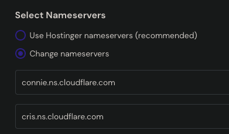
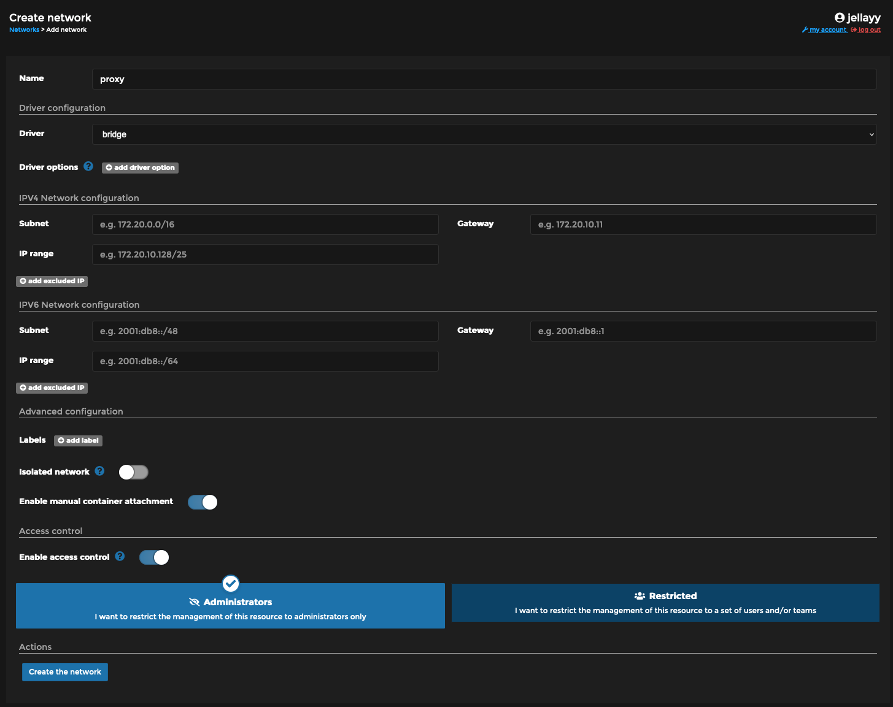
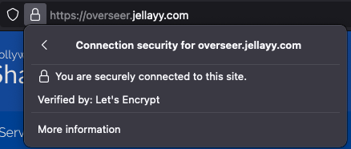

## Credits

Reverse Proxies and setting up authentication on them can be very hard to wrap your head around and get working at first. While I will do my best to continue to update this guide to be as comprehensive as possible, I would like to point out the articles and resources that really helped me to learn this:

- [Joshua Avalon - Setup Traefik v2 Step by Step](https://joshuaavalon.io/setup-traefik-v2-step-by-step)
- [Techno Tim - 2 Factor Auth and Single Sign on with Authelia](https://joshuaavalon.io/setup-traefik-v2-step-by-step)

## Prerequisites

All files used in this guide can be found [here](https://github.com/Jellayy/jellayy.github.io/tree/master/resources/2022-09-25-traefik)

This guide will be assuming you are deploying the services you want to reverse proxy in Docker and are provisioning them with Docker Compose.

To receive TLS Certs you must own and control the domain you are deploying to. This does not mean you have to expose these services to the internet or even add any public records to your domain, you can have certs issued for domains that are used exclusively locally.

## Configuring Your Domain

### Cloudflare DNS

This setup will be based on using the Cloudflare API to manage DNS on your domain. We will be using DNS challenges to issue certs with LetsEncrypt.

### Import your domain as a Cloudflare site (Optional)

If you purchased your domain through cloudflare, feel free to skip this step. If you got your domain through another registrar, you can register your site through cloudflare using the steps below.

#### Change your DNS servers to Cloudflare's

If you haven’t purchased your domain through Cloudflare, you can still continue with this guide by changing the DNS servers your domain uses over to Cloudflare’s. Change your nameservers to: `connie.ns.cloudflare.com` and `cris.ns.cloudflare.com`

Here's an example using Hostinger's dashboard:



#### Add your site to Cloudflare

After changing your DNS servers, you can add your site to Cloudflare under Websites>Add a Site. For our purposes, the free plan works fine.

### Create an API Key

Head over to the [Cloudflare API Tokens Page](https://dash.cloudflare.com/profile/api-tokens) and create a new API Token with Zone.Zone and Zone.DNS permissions on either just the sites you want or all of your sites.


## Deploying Traefik

### File Structure

Deploying Traefik isn’t completely plug-and-play and needs some files to get started.

Wherever you wish to place your Traefik configuration files, create the following file structure. You’ll need to create all files listed, traefik does not create them itself and will yell at you if you don’t. Create `acme.json` as an empty file for traefik to fill, we will configure `traefik.yml` in the next step.

```
traefik
│   traefik.yml   
│
└───acme
│   │   acme.json
│   
└───dynamic
```

#### traefik.yml

Below is an example basic configuration of `traefik.yml` that will serve our purposes for now

```yml
global:
  checkNewVersion: true
  sendAnonymousUsage: false  # true by default

# (Optional) Log information
log:
   level: INFO  # DEBUG, INFO, WARNING, ERROR, CRITICAL
   format: common  # common, json, logfmt
   filePath: /var/log/traefik/traefik.log

# (Optional) Enable API and Dashboard
api:
  dashboard: true  # true by default
  insecure: false  # Don't do this in production!

# Entry Points configuration
entryPoints:
  http:
    address: :80
    http:
      redirections:
        entryPoint:
          to: https
          scheme: https

  https:
    address: :443

# Configure your CertificateResolver here...
certificatesResolvers:
   letsEncrypt:
     acme:
       email: YOUR_EMAIL
       storage: /etc/traefik/acme/acme.json
       dnsChallenge:
         provider: cloudflare
         resolvers:
           - 1.1.1.1:53
           - 8.8.8.8:53
         delayBeforeCheck: 0

providers:
  docker:
    endpoint: unix:///var/run/docker.sock
    exposedByDefault: false  # Default is true
  file:
    # watch for dynamic configuration changes
    directory: /etc/traefik/dynamic
    watch: true
```

### Docker

#### Proxy Network

Create a new attachable bridge network in Docker for Traefik to use. This can be done in the docker CLI or through a managment portal such as Portainer. We will attach our Traefik container and all other proxied containers to this network.

```sh
docker network create -d bridge --attachable proxy
```



#### Creating the Container

Deploy Traefik using Docker Compose

```yml
version: '3'

services:
  traefik:
    image: "traefik:v2.5"
    container_name: "traefik"
    environment:
      - CF_API_EMAIL=YOUR_EMAIL
      - CF_DNS_API_TOKEN=YOUR_API_KEY
      - CF_ZONE_API_TOKEN=YOUR_API_KEY
    networks:
      - proxy
    ports:
      - "80:80"
      - "443:443"
      # (Optional) Expose Dashboard
      - "42069:8080"  # Don't do this in production!
    volumes:
      - /config/docker/traefik-logs:/var/log/traefik
      - /config/docker/traefik:/etc/traefik
      - /var/run/docker.sock:/var/run/docker.sock:ro

networks:
  proxy:
    external: true
```

   Leaving your API keys exposed in docker-compose like this is not recommended. Environment variables in docker containers also aren’t particularly secure. Running a secrets agent like the one built in to docker-swarm is recommended. Will I be covering that here? Absolutely not.


## Configuring Local DNS

If you’re using Traefik as a reverse proxy for exclusively local services, you will need to configure a wildcard DNS entry on your network’s DNS server to point at Traefik, be that the DNS resolver on your router, or something more dedicated like a Pihole. Below are instructions for pfSense & Pihole

### pfSense

In pfSense you can create a wildcard entry in the `Custom Options` section of Unbound at Services>DNS Resolver>General Settings:

```
server:
local-zone: "example.com" redirect
local-data: "example.com 3600 IN A 192.168.1.54"
```

This config will match `*.example.com` to `192.168.1.54`

### Pihole

Wildcard entries aren't supported in Pihole's UI. To add one, you'll have to ssh in and edit some files.

We're looking for the `/etc/dnsmasq.d` directory which holds all of our custom DNS configuration. Create a new file in this directory and it will be automatically loaded. We'll call ours `05-wildcards.conf`:

```conf
# Pi-hole dnsmasq configuration
# Wildcard entries for reverse proxies

address=/example.com/192.168.1.54
```

This config will match `*.example.com` to `192.168.1.54`

## Adding Docker Services to Traefik

Thankfully, once Traefik is configured, adding new services is a simple as adding some extra configuration to your containers. Here’s a docker-compose example of deploying [Homer](https://github.com/bastienwirtz/homer), a static homepage service.

```yml
version: "2"

services:
  homer:
    image: b4bz/homer
    container_name: homer
    networks:
      - proxy # Required for Traefik
    volumes:
      - /homer_assets:/www/assets
    user: 1000:1000
    labels:
      - "traefik.docker.network=proxy" # Connect to traefik's docker network
      - "traefik.enable=true" # Enable traefik
      - "traefik.http.routers.homer.rule=Host(`example.com`)" # Configure 'homer' router host rule
      - "traefik.http.routers.homer.entrypoints=https" # Enable https entrypoint on 'homer' router
      - "traefik.http.routers.homer.tls=true" # Enable tls on 'homer' router
      - "traefik.http.services.homer.loadbalancer.server.port=8080" # Port to redirect to in container
      - "traefik.http.routers.homer.tls.certresolver=letsEncrypt" # Use letsEncrypt certresolver defined in traefik.yml
    restart: unless-stopped

networks:
  proxy: # Add a refrence to traefik's docker network here
    external: true
```

If everything went well, your definied address should route to your service and your cert will be issued!



## Authelia

### Deploying Authelia

#### File Structure

Like Traefik, theres a bit of configuration we have to do before deploying Authelia. The file structure for Authelia is very simple:

```
authelia
│   configuration.yml 
│   users_database.yml
```

##### configuration.yml

```yml
---
###############################################################
#                   Authelia configuration                    #
###############################################################

jwt_secret: a_very_important_secret
default_redirection_url: https://public.example.com

server:
  host: 0.0.0.0
  port: 9091

log:
  level: debug
# This secret can also be set using the env variables AUTHELIA_JWT_SECRET_FILE

totp:
  issuer: authelia.com

# duo_api:
#  hostname: api-123456789.example.com
#  integration_key: ABCDEF
#  # This secret can also be set using the env variables AUTHELIA_DUO_API_SECRET_KEY_FILE
#  secret_key: 1234567890abcdefghifjkl

authentication_backend:
  file:
    path: /config/users_database.yml
    password:
      algorithm: argon2id
      iterations: 1
      salt_length: 16
      parallelism: 8
      memory: 64

access_control:
  default_policy: deny
  rules:
    # Rules applied to everyone
    - domain: public.example.com
      policy: bypass
    - domain: traefik.example.com
      policy: one_factor
    - domain: secure.example.com
      policy: two_factor

session:
  name: authelia_session
  # This secret can also be set using the env variables AUTHELIA_SESSION_SECRET_FILE
  secret: unsecure_session_secret
  expiration: 3600  # 1 hour
  inactivity: 300  # 5 minutes
  domain: example.com  # Should match whatever your root protected domain is

  # redis:
  #   host: redis
  #   port: 6379
  #   # This secret can also be set using the env variables AUTHELIA_SESSION_REDIS_PASSWORD_FILE
  #   # password: authelia

regulation:
  max_retries: 3
  find_time: 120
  ban_time: 300

storage:
  encryption_key: you_must_generate_a_random_string_of_more_than_twenty_chars_and_configure_this
  local:
    path: /config/db.sqlite3

notifier:
  smtp:
    username: test
    # This secret can also be set using the env variables AUTHELIA_NOTIFIER_SMTP_PASSWORD_FILE
    password: password
    host: mail.example.com
    port: 25
    sender: admin@example.com
...
```

There’s a lot of stuff to configure in here, but to get started there’s only a few things we need to do

1. Create a `jwt_secret`, an alphanumeric key of 64 characters:
    
    ```yml
    jwt_secret: DHUAov7n9VTchKhgP5XRjraZdD6qJq2ck8SeMWjy2J5memk7JUwZEuZAoxKHkC7i
    ```
    
    Please make your own and don’t copy paste this
    


1. Change the provided `access_control` policy. [Authelia Access-Control Docs](https://www.authelia.com/configuration/security/access-control/)

    ```yml
    access_control:
      default_policy: deny
      rules:
        # Rules applied to everyone
        - domain: service.example.com
          policy: two_factor
    ```

1. Update the domain in the `session` section to the domain you’re protecting:

    ```yml
    domain: example.com  # Should match whatever your root protected domain is
    ```

1. Generate an encryption key for sqlite storage

    ```yml
    storage:
      encryption_key: you_must_generate_a_random_string_of_more_than_twenty_chars_and_configure_this
    ```

1. Setup email notifier for forgotten passwords.

    I won’t be covering how to get this setup with SMTP. There are simple ways to do this through your gmail account or other providers. You can also write these notifications to a local file, which isn’t recommended for any amount of users over one.

    ```yml
    notifier:
      filesystem:
        filename: /config/notification.txt
    ```

##### users_database.yml

```yml
---
###############################################################
#                         Users Database                      #
###############################################################

# This file can be used if you do not have an LDAP set up.

# List of users
users:
  authelia:
    displayname: "Authelia User"
    # Password is authelia
    password: "$6$rounds=50000$BpLnfgDsc2WD8F2q$Zis.ixdg9s/UOJYrs56b5QEZFiZECu0qZVNsIYxBaNJ7ucIL.nlxVCT5tqh8KHG8X4tlwCFm5r6NTOZZ5qRFN/"  # yamllint disable-line rule:line-length
    email: authelia@authelia.com
    groups:
      - admins
      - dev
...
```

Create your first users with the steps below:

1. Change your displayname:

    ```yml
    users:
      example:
        displayname: "Example"
    ```

1. Change your hashed password

    ```yml
    password: "$argon2id$v=19$m=65536,t=3,p=4$d3hKRUpCSUhLMEhxVXdoZg$eChQ4l0qnt4oCE7Yaw+bVp1wi7/CO3PqlqEY+udUkYc"  # yamllint disable-line rule:line-length
    ```
    
    Authelia provides a tool for creating hashed passwords using the proper hashing algorithm. Generate a password by running `docker run authelia/authelia:latest authelia hash-password 'YOUR_PASSWORD'`
    

1. Change your email address

    ```yml
    email: example@example.com
    ```

#### Creating the Container

After configuring your file structure, deploy Authelia with the compose below:

```yml
version: '3'

services:
  authelia:
    image: authelia/authelia
    container_name: authelia
    volumes:
      - /config/docker/authelia:/config
    networks:
      - proxy
    labels:
      - "traefik.enable=true"
      - "traefik.http.routers.authelia.rule=Host(`auth.example.com`)" # Change to your domain
      - "traefik.http.routers.authelia.entrypoints=https"
      - "traefik.http.routers.authelia.tls=true"
      - "traefik.http.routers.authelia.tls.certresolver=letsEncrypt"
      - "traefik.http.middlewares.authelia.forwardauth.address=http://authelia:9091/api/verify?rd=https://auth.example.com" # Change to your domain
      - "traefik.http.middlewares.authelia.forwardauth.trustForwardHeader=true"
      - "traefik.http.middlewares.authelia.forwardauth.authResponseHeaders=Remote-User,Remote-Groups,Remote-Name,Remote-Email"
    expose:
      - 9091
    restart: unless-stopped
    environment:
      - TZ=America/Phoenix
    healthcheck:
      disable: true

networks:
  proxy:
    external: true
```

### Adding Docker Services to Authelia

Much like with Traefik, it is very easy to add containers to Authelia. Here’s our same Homer example from before, but this time with Authelia:

```yml
version: "2"

services:
  homer:
    image: b4bz/homer
    container_name: homer
    networks:
      - proxy # Required for Traefik
    volumes:
      - /homer_assets:/www/assets
    user: 1000:1000
    labels:
      - "traefik.docker.network=proxy"
      - "traefik.enable=true"
      - "traefik.http.routers.homer.rule=Host(`example.com`)"
      - "traefik.http.routers.homer.entrypoints=https"
      - "traefik.http.routers.homer.tls=true"
      - "traefik.http.services.homer.loadbalancer.server.port=8080"
      - "traefik.http.routers.homer.tls.certresolver=letsEncrypt"
      - "traefik.http.routers.homer.middlewares=authelia@docker" # This line adds the Authelia middleware to Homer
    restart: unless-stopped

networks:
  proxy: # Add a refrence to traefik's docker network here
    external: true
```

  With version 2.5 of traefik, you’ll get Traefik logs saying `middleware "authelia@docker" does not exist`. These logs are a lie. This is apparently a known issue and Authelia is working correctly if you see these. I have not tested to see if this is fixed in newer versions.


#### Updating access_control

It is likely that as you add services to Authelia, you may need to update the `access_control` section of your `configuration.yml`. By default, the config is set to deny access to undefined addresses, resulting in a 403: forbidden when you visit the site.
