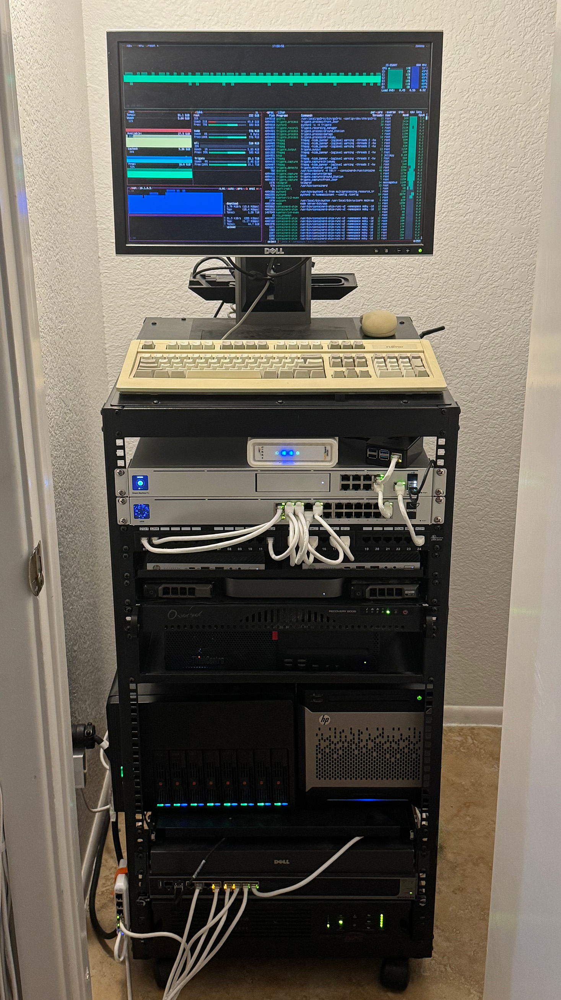

## New Goals: From Power to Efficiency

Gone are the carefree days of tapping into free electricity in my college dorms. Now, I face the harsh reality of managing power consumption and heat output in my homelab, especially during scorching Arizona summers. I don't have a post up on Homelab V2 because I can't seem to find any good pictures but it *sucked* power.

Homelab V2 mainly consisted of two servers:

1. My custom-built Proxmox server from Homelab V1, featuring dual Xeon E5-2658V2 CPUs
1. A Dell PowerEdge R720 with a similar dual-socket setup and at least 112GB of RAM

The custom build sported a 500W consumer PSU, while the Dell had dual 1200W power supplies. The Dell especially was infamously loud.

These enterprise-grade servers offered unbeatable core counts, RAM, and storage options for their price. However, their inefficiency became a glaring issue that demanded a solution.

## The Shift to Efficiency: Homelab V3

Homelab V3 marks a paradigm shift, prioritizing power efficiency over raw performance. Out went the hulking enterprise hardware, in came comsumer-grade mini-PCs housing laptop chips. These compact devices offer several advantages:

- Availability: They're often liquidated by businesses, making them readily available on eBay at attractive prices
- Modern Architecture: Despite lower thread counts, they feature newer generation processors (often 8th and 9th gen Intel i7s)
- Improved Performance: Their signifigantly faster single-core performance more than compensates for the reduced thread count.
- Power Consumption: This is the kicker. Even with all these benefits, the CPUs in these machines boast ~35W TDPs.

My new setup now includes:

- Two HP Elitedesk 800 G4 Mini-PCs
  
  These are going to be the new compute workhorses of the lab, and they're pretty well equipped to do so.
  - CPUs: Intel i5-8500T
  - RAM: 16GB
  - Storage: 256GB SSD
  - Price: Acquired a year apart, first for $200, second for just $95

- HP ProLiant Microserver Gen 8
  
  The Elitedesks can't offer any mass storage capabilities for the lab, so I needed a separate NAS.
  - CPU: Xeon E3-1265L V2 (Upgraded from the stock Celeron G1610T)
  - RAM: 16GB
  - Backplane: 4 SAS-Capable Bays after an HBA swap
  - Storage: 4 8TB SAS HDDs & 1 500GB Boot SSD
  - Out-of-band Management

  This server ended up being a great candidate for a small and efficient dedicated TrueNAS box. I'm pretty sure the drives I have in it are the main power draw.

- Semi-Custom 1U Build
  
  This was a carry-over from Homelab V2 and previously served as my pfSense router. Now it runs all the monitoring for the lab.
  - Motherboard: Some ASRock Rack Embedded Product
  - CPU: Atom C2750
  - RAM: 8GB
  - Case: Supermicro 1U

- 2018 Mac Mini
  
  This basically *just* runs FindMyHistory, a community script I've contributed to that stores historic tracking data for your AirTags. Otherwise, a Mac Mini is an absolutely horrible server, a complete pain to run headlessly, and something I wouldn't wish on my worst enemy.

## Results

### CPU TDP & HDD Power Consumption

Starting out looking only at TDPs and expected HDD consumption already reveals a signifigant reduction:

| Homelab V2     | TDP (W) | - | Homelab V3     | TDP (W) |
| -------------- | ------- | - | -------------- | ------- |
| pfSense        | 20      | - | UDM Pro        | 33      |
| Netgear GS516T | 70      | - | USW 24         | 25      |
| Custom Proxmox | 190     | - | Elitedesk 1    | 35      |
|                |         | - | Elitedesk 2    | 35      |
|                |         | - | Mac Mini       | 65      |
| Custom 1U      | 20      | - | Custom 1U      | 20      |
| Dell R720      | 190     | - | Microserver G8 | 45      |
| 6x 3TB SAS     | 68      | - | 4x 8TB SAS     | 45      |
| Total          | 558     | - | Total          | 303     |

### Real Average Usage

To get a more realistic picture of power consumption, I didn't just want to look at TDPs or even idle consumption. So I measured what I'm going to call "Real Average Usage". This metric represents the average power draw during normal workloads, each server's workloads aren't being pushed to the limit but they definitely aren't idling either. The "Real Average Usage" shows what we can expect their power consumption to be 90% of the time while carrying out their daily workloads.

One example of this you'll see is the difference between my two Elitedesk servers:
- The first Elitedesk server, primarily running public web servers, draws only 5 watts.
- The second, funtioning as an NVR that restreams and runs AI detections on all of my security cameras, consumes much more power. The Coral.ai PCI TPU I use for AI detections consumes 22 watts of system power alone.

| Homelab V2         | RAU (W) | - | Homelab V3              | RAU (W) |
| ------------------ | ------- | - | ----------------------- | ------- |
| pfSense            | 18      | - | UDM Pro                 | 25      |
| Netgear GS516T     | 50      | - | USW 24                  | 22      |
| Custom Proxmox     | 125     | - | Elitedesk 1             | 5       |
|                    |         | - | Elitedesk 2             | 46      |
|                    |         | - | Mac Mini                | 6       |
| Custom 1U          | 11      | - | Custom 1U               | 11      |
| Dell R720 + Drives | 182     | - | Microserver G8 + Drives | 65      |
| Total              | 386     | - | Total                   | 180     |

The Real Average Usage comparison between Homelab V2 and V3 yielded impressive results, decreasing usage from 386W to just 180W total.

This means the entire Homelab V3 setup, which has more effective processing power and does much more than it used to, draws less power than just my R720 used to. That *includes* routing and switching.

On top of this, noise and heat output have been *dramatically* reduced, which is great for a Homelab that I run in a closet under my stairs.

## Offsite Backups

You thought I'd just get rid of the old trusty Dell R720? Nope!

While this is a bit overkill for an offsite backup solution, I was given the opportunity to put it in a datacenter colocation, which means I can backup my important TrueNAS datasets offsite in case something catastrophic were to happen to my rack.

Colocations in datacenters work a bit differently than you would expect. For example, you pay a flat rate for a power circuit with your rack, so any consumption up to the limit of your circuit doesn't introduce any extra cost. Suddenly the high power consumption, heat, and loudness of the R720 are no longer a problem. It's almost like the datacenter is it's natural habitat.

Currently, my R720 is running the drives from my old TrueNAS pools in Homelab V2 and runs on top of Proxmox. It gets a peer-to-peer connection directly to my NAS at home through Tailscale, which was by far the most seamless VPN I've ever setup.

## Diagram

No homelab post is complete without a cool diagram of all the hardware and everything you're hosting:

## Rack

The under-stairs server closet in her full glory. Don't pay too much attention to the part where I started getting lazy crimping all the patch cables.

You'll notice there are a couple extra servers in this rack that aren't mine. For the purposes of documenting my homelab, I didn't include those.

