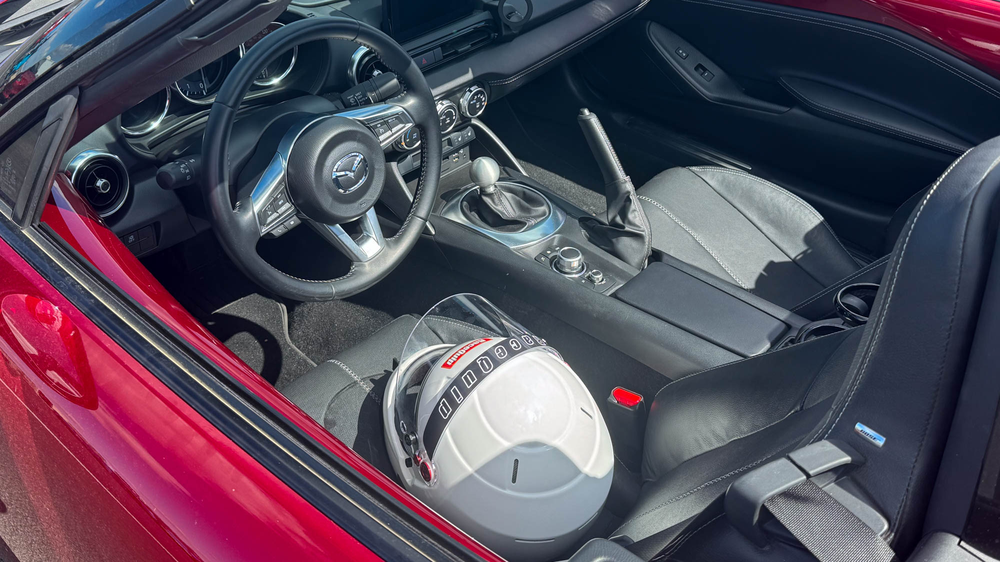
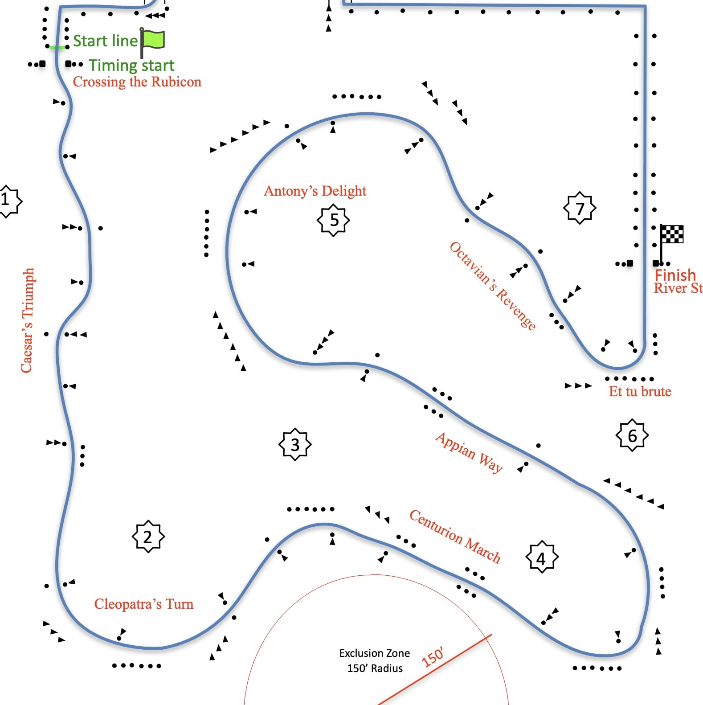

This month I participated in my first motorsport event: the Phoenix AZ Solo Region SCCA Autocross. I had two goals coming in to the event: to not kill any cones and to be competitive in the novice class. Boy were those goals ambitious.

The first thing I learned very quickly is that hitting cones is an incredibly natural part of autocross. The best drivers putting up the best times hit cones, that's how you find the limits and know to dial them back in your next lap. There are whole teams of courseworkers dedicated to fetching and standing up cones when it happens. Being a cone runner actually ended up being one of my favorite parts of the event. I was placed on the final hairpin corner, which proved to be the toughest part of the course for all drivers. I wish I had my cone duty work assignment before I did my laps, because I got to see super up close how people were successfully taking that corner and how people were going off. I probably would've been able to prevent my second DNF if that was the case.

On my second goal, I was *not* very competitive in my class. Reading cones is hard and something that only started coming to me on my final runs. With no lines painted on the ground and no visible ends of tarmac, you have to practice looking much farther down the course than you're used to to be prepared for the next gate. On my first run, I blatantly missed an entire corner because I wasn't looking far enough ahead and it snuk up on me quicker than I anticipated, something the novice coursewalk definitely didn't prepare me for. Thankfully, there were plenty of helpful people at the event and someone was able to ride along with me to talk me through the course for a lap which helped a lot. My next DNF only came from cutting the final hairpin.

Another thing the novice coursewalk/meeting didn't prepare me for was how grid order worked. I had the impression that people lined up in their groups when they were ready, which was very wrong. Only after I ran out of order did someone explain to me that your group first lines up in numbered grid spots at the beginning of the session and are let out on course in order. So if you're going to your first autocross event, definitely find out early where the grid is and how it works.

On preparedness and things to bring, I ended up bringing a lot of things for my car and not for myself. I pulled up to the paddock and got out all my tools for my car, checked air pressures, aired up, etc and immediately someone pulled up next to me and started getting out an umbrella and some camping chairs. That was much smarter than what I did. The only things I had brought for *myself* were a sandwich and a bottle of water. I ended the event very tired and very sunburnt. Definitely think of the squishy thing in the driver's seat when bringing equipment for motorsport events.

For my next autocross, I definitely want to slow down a bit. I found myself immediately pushing for lap times in my first event, which caused a lot of penalties & DNFs. I noticed the more experienced drivers start out with a more parade-pace lap to learn the course, then start seeing where they can push the envelope. I'm going to get my goals in check and focus on learning the course better, not pushing for land speed records, and cutting down significantly on DNFs. **I'm also going to wear sunblock**.

## My Times

- Car: `2023 Mazda MX-5 Miata`
- Class: `CS`
- Class Modifier: `Novice`

2025 CS PAX Index: `0.813`

| Lap | Raw Time | Penalties | Final Time | PAX Time |
| --- | -------- | --------- | ---------- | -------- |
| 1   | 62.356   | DNF       | X          | X        |
| 2   | 57.755   | +1        | 58.755     | 47.767   |
| **3**   | **53.357**   |           | **53.357**     | **43.379**   |
| 4   | 52.985   | +1        | 53.985     | 43.889   |
| 5   | 52.605   | +1 DNF    | X          | X        |

Standings:

| Category            | Place | Total |
| ------------------- | ----- | ----- |
| Novice              | 13th  | 18    |
| Overall (PAX Time)  | 126th | 142   |
| Overall (Fast Time) | 129th | 142   |

## Course Map

