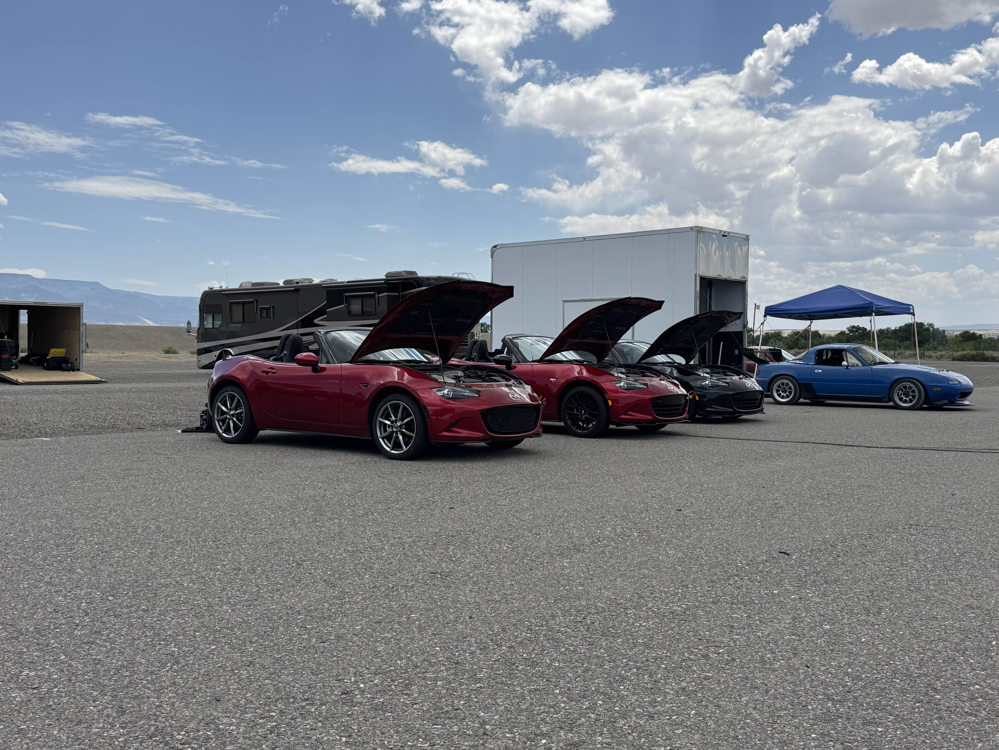
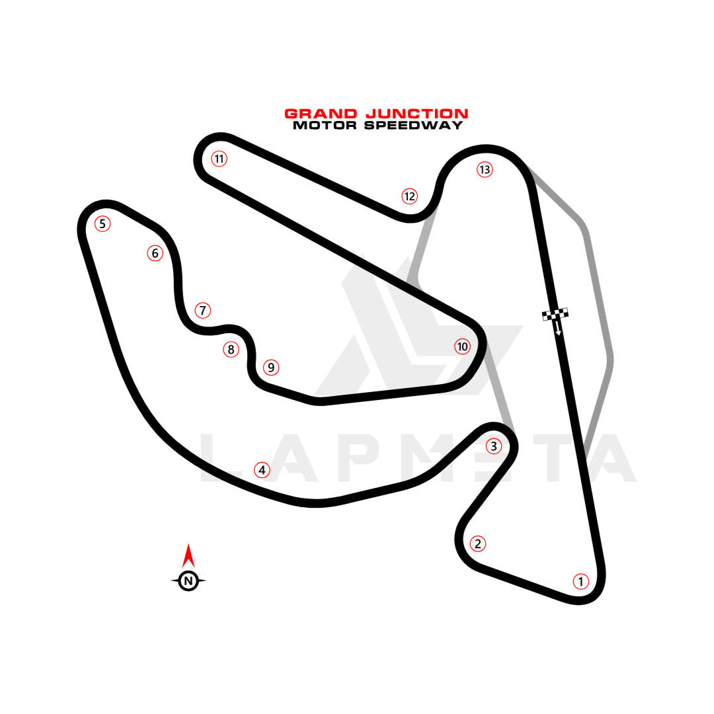



This year, I roadtripped up to Colorado from Arizona to take part in Flyin' Miata's Miata Summer Camp event. Part of this event was their all Miatas track day at Grand Junction Motor Speedway.

This was my first real track day, and it was a great way to get started. Grand Junction Motor Speedway was originally built as a larger go-kart track which lends itself as a perfect track for Miatas: There aren't any super long straightaways with harsh braking zones to satisfy the V8s and plenty of technical low-speed corners.

The event was setup very novice friendly as well. Everyone was split into run groups of about ~6 cars sent out onto track with a ~15 second gap for 5 laps (1 warmup, 3 timed, 1 cooldown), no passing. I liked this setup a lot more than the autocrosses I've attended in Arizona so far. You get a lot more time out on track and successive flying laps mean you don't have to put your all into one run, wait 10 minutes, and go out for one run again.

Because of how we were sent out, I did hit some slower cars in front of me on my 1st and 4th sessions which shows up in my average times for those runs. Other than that, I had plenty of space in front of me to get my timed runs in.

My Miata is still functionally stock (just an axle-back exhaust) but still did great on track. One thing I was worried about on the drive up was my brakes. I've got the Grand Touring trim without the Brembo+BBS+Recaro package, so I've got some pretty tiny pads and calipers. All I've added is a brake fluid flush with some Motul RBF 600 to prevent boiling. Despite that, the stock brakes and tires did great on this track. I was working ABS in most braking zones and didn't run into any fading. The car even performed a bit better with some heat put into it, there were a couple occasions where I'd run a bit long and wide in the first braking zone on my first timed lap, but perform much better on laps 2 and 3.

## My Times

- Car: `2023 Mazda MX-5 Miata`

| Session | Average Time | Best Time    |
| ------- | ------------ | ------------ |
| 1       | 1:22.548     | 1:14.589     |
| 2       | 1:14.541     | 1:13.078     |
| 3       | 1:12.264     | 1:12.048     |
| 4       | 1:17.156     | 1:12.630     |
| **5**   | **1:11.982** | **1:11.938** |

Standings:

| Category           | Place | Total |
| ------------------ | ----- | ----- |
| Overall (Thursday) | 11th  | 22    |
| Overall (3 days)   | 42nd  | 78    |

## Track Map

